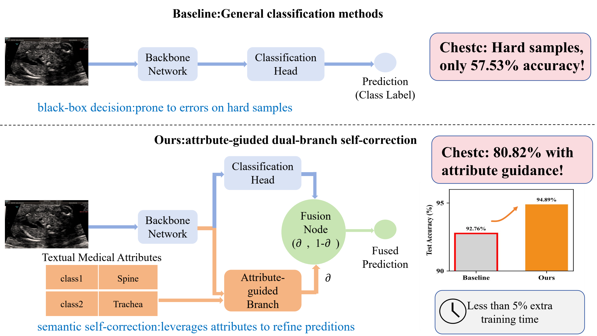
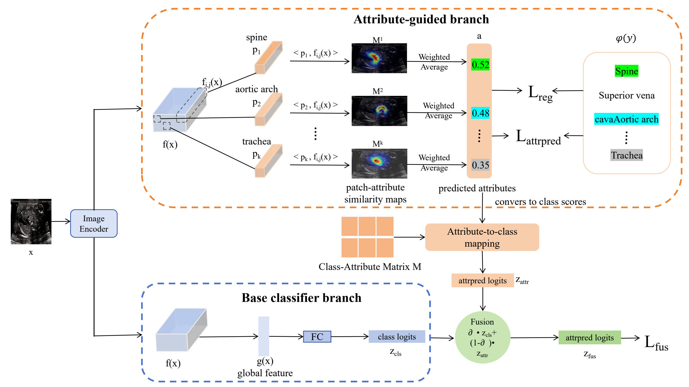
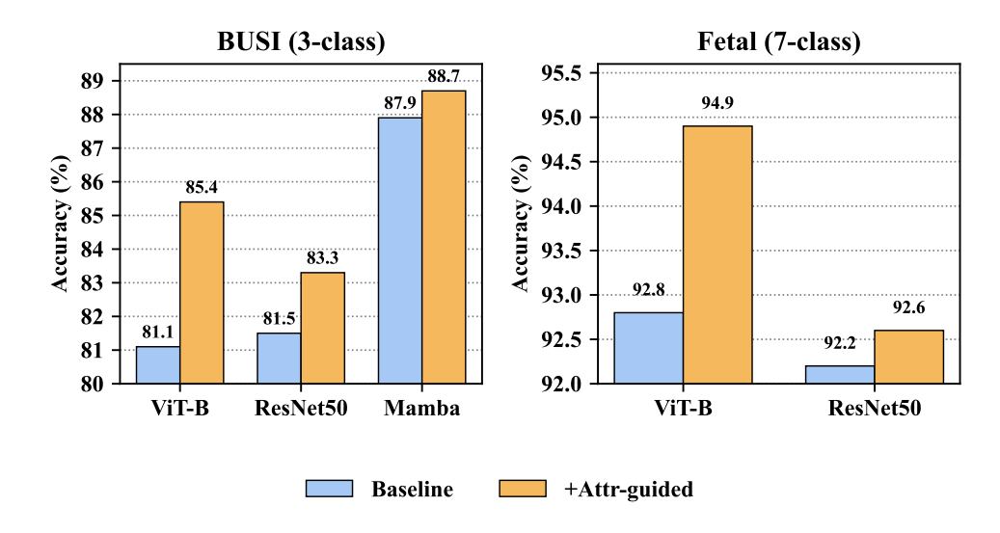
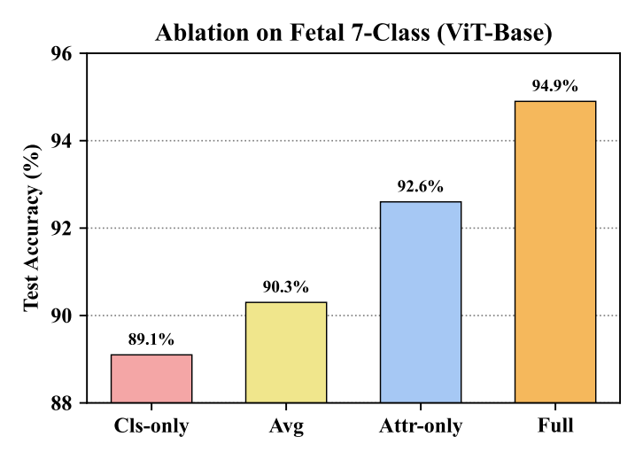
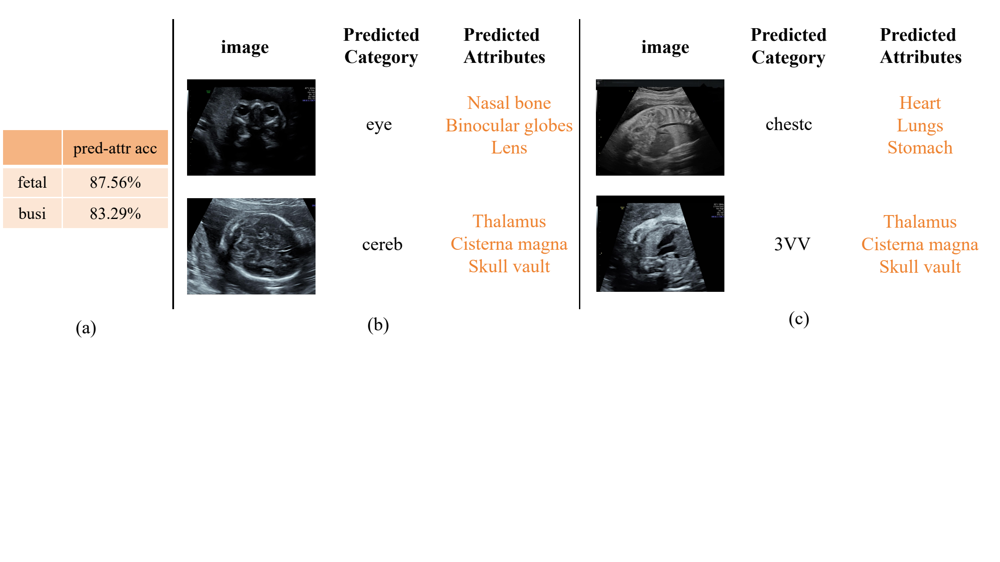

# AttrGuide: Boosting Ultrasound Image Classification via Attribute-Guided Dual-Branch Framework

<p align="center">
  <a href="#citation">
    
  </a>
  <a href="https://github.com/zhaobo253-crypto/AttrGuide">
    
  </a>
  <a href="#data-preparation">
    
  </a>
  <a href="MODEL_ZOO.md">
    
  </a>
  <a href="LICENSE">
    
  </a>
</p>

<p align="center">
  <b>MICCAI 2026</b>
</p>

<p align="center">
  <a href="#introduction">Introduction</a> |
  <a href="#method">Method</a> |
  <a href="#quick-start">Quick Start</a> |
  <a href="#main-results">Main Results</a> |
  <a href="#repository-structure">Repository Structure</a> |
  <a href="#citation">Citation</a>
</p>

<p align="center">
  
</p>

<p align="center">
  <sub><em><strong>Motivation.</strong> Standard ultrasound classifiers can fail on hard cases because they mainly rely on global visual patterns. AttrGuide introduces an attribute-guided branch for lightweight semantic self-correction.</em></sub>
</p>

## Introduction

Ultrasound image classification is essential for computer-aided diagnosis, but ultrasound images often contain speckle noise, low contrast, operator dependence, device variation, and subtle lesion morphology. These factors make reliable recognition challenging and limit the clinical trustworthiness of purely black-box models.

**AttrGuide** is a plug-and-play attribute-guided dual-branch framework for ultrasound classification. It keeps the original image classifier as a baseline branch, injects domain-agnostic medical attributes through an additional semantic branch, and adaptively fuses the two predictions. The goal is to improve both classification performance and interpretability without requiring dense pixel-level attribute annotations.

This repository provides the public implementation for BUSI breast ultrasound classification with ResNet50 and ViT-B backbones, including baseline trainers, AttrGuide trainers, attribute embedding generation, example attribute tables, and release notes for large files. Private fetal and thyroid ultrasound datasets used in the paper are not redistributed.

## Motivation

Existing ultrasound classifiers mainly optimize category prediction. This can work for easy samples, but it provides limited control over whether the model has learned clinically meaningful cues such as lesion shape, margin, orientation, posterior acoustic behavior, and tissue distortion.

AttrGuide introduces explicit medical attribute priors as semantic anchors. These priors are useful because:

- **Robustness:** attribute cues help correct predictions when global appearance is ambiguous.
- **Interpretability:** the attribute branch exposes human-readable evidence for model decisions.
- **Low adaptation cost:** category-level attribute tables are sufficient; dense attribute labels are not required.

## Method

AttrGuide treats an existing encoder plus classifier as the baseline branch. A parallel attribute-guided branch reuses the encoder features, aligns local visual features with CLIP-derived attribute prototypes, maps attribute scores to class logits through a fixed class-attribute matrix, and fuses the baseline and attribute predictions with a lightweight decision module.

<p align="center">
  
</p>

<p align="center">
  <sub><em><strong>AttrGuide pipeline.</strong> The baseline branch preserves the original classifier, while the attribute-guided branch injects medical priors and produces interpretable class evidence before adaptive fusion.</em></sub>
</p>

The framework contains three main components:

- **Medical attribute semantic space:** task-discriminative ultrasound attributes are encoded by a CLIP text encoder and used as semantic prototypes.
- **Attribute-guided branch:** image features are matched to attribute prototypes to produce attribute activations and attribute-based class logits.
- **Adaptive decision fusion:** a learnable fusion module combines baseline logits and attribute-guided logits for final prediction.

## Contributions

- We propose a plug-and-play medical-prior module for ultrasound image classification.
- We inject domain-agnostic clinical attributes into existing visual classifiers without requiring dense attribute annotation.
- We use an adaptive dual-branch decision module to combine global visual evidence and attribute-based semantic evidence.
- We validate that AttrGuide improves multiple backbones and ultrasound tasks with low additional training cost.

## Quick Start

### Setup Environment

```bash
git clone https://github.com/zhaobo253-crypto/AttrGuide.git
cd AttrGuide

conda env create -f environment.yml
conda activate attrguide
```

You can also install the Python packages with pip:

```bash
pip install -r requirements.txt
```

The environment uses PyTorch, TorchVision, scikit-learn, pandas, OpenAI CLIP, and Weights & Biases. WandB logging is disabled by default unless `--use_wandb` is provided.

### Data Preparation

Download the public BUSI dataset from its official source or a community mirror:

- Official BUSI dataset page: <https://scholar.cu.edu.eg/?q=afahmy/pages/dataset>
- Kaggle mirror: <https://www.kaggle.com/datasets/aryashah2k/breast-ultrasound-images-dataset>

Arrange the dataset as follows:

```text
data/breastdata/
|-- train/
|   |-- benign/
|   |-- malignant/
|   `-- normal/
|-- val/                  # optional; if absent, train/ is split into train/val
|   |-- benign/
|   |-- malignant/
|   `-- normal/
`-- test/
    |-- benign/
    |-- malignant/
    `-- normal/
```

Mask files whose names contain `_mask` are ignored automatically.

Prepare the class-level breast attribute table:

```bash
cp examples/attributes_breast.csv data/attributes_breast.csv
```

The table should contain a `name` or `folder` column matching the folder names and one or more attribute columns.

### Generate Attribute Embeddings

Run this step once before training AttrGuide:

```bash
cd Scripts/resnet50_attrguide
python generate_attribute_embeddings.py \
  --attr_csv ../../data/attributes_breast.csv \
  --output_path ../../data/attribute_embeddings_3cls_breast.pt \
  --clip_model ViT-B/32 \
  --prompt_template "an ultrasound image showing {attr}" \
  --overwrite
```

The generated embedding file can be reused by both ResNet50 and ViT-B AttrGuide experiments.

### Run Experiments

Train ResNet50 with AttrGuide:

```bash
cd Scripts/resnet50_attrguide
python train_attrguide.py \
  --data_root ../../data/breastdata \
  --attr_csv ../../data/attributes_breast.csv \
  --precomputed_attr_emb ../../data/attribute_embeddings_3cls_breast.pt \
  --backbone resnet50 \
  --resnet_path ../../checkpoints/pretrained/resnet50-11ad3fa6.pth \
  --epochs 100 \
  --batch_size 32 \
  --lr 0.0001 \
  --save_dir ../../checkpoints/resnet50_attrguide \
  --no_wandb
```

Train ViT-B with AttrGuide:

```bash
cd Scripts/vitbase_attrguide
python train_attrguide.py \
  --data_root ../../data/breastdata \
  --attr_csv ../../data/attributes_breast.csv \
  --precomputed_attr_emb ../../data/attribute_embeddings_3cls_breast.pt \
  --backbone vitbase \
  --resnet_path ../../checkpoints/pretrained/vit_b_16-c867db91.pth \
  --epochs 100 \
  --batch_size 32 \
  --lr 0.0001 \
  --save_dir ../../checkpoints/vitbase_attrguide \
  --no_wandb
```

Run baseline experiments:

```bash
cd Scripts/resnet50_baseline
python train_baseline.py \
  --data_root ../../data/breastdata \
  --backbone resnet50 \
  --resnet_path ../../checkpoints/pretrained/resnet50-11ad3fa6.pth \
  --no_wandb

cd ../vitbase_baseline
python train_baseline.py \
  --data_root ../../data/breastdata \
  --backbone vitbase \
  --resnet_path ../../checkpoints/pretrained/vit_b_16-c867db91.pth \
  --no_wandb
```

## Main Results

AttrGuide consistently improves ultrasound classification across backbone families, recent methods, and disease categories.

<p align="center">
  
</p>

<p align="center">
  <sub><em><strong>Main comparison.</strong> Adding attribute guidance improves BUSI breast ultrasound classification with both CNN and Transformer backbones.</em></sub>
</p>

### BUSI Main Comparison

| Method | BUSI ACC |
| --- | ---: |
| BU-Mamba | 87.86 +/- 2.72 |
| AttrGuide (Ours) | **88.72 +/- 1.90** |

### Cross-Backbone Analysis on BUSI

| Backbone / Method | Base | +AttrGuide | Improvement |
| --- | ---: | ---: | ---: |
| ResNet50 | 81.5 | **83.3** | +1.8 |
| ViT-B | 81.1 | **85.4** | +4.3 |
| BU-Mamba | 87.9 | **88.7** | +0.9 |
| DiffMIC-v2 | 60.0 | **63.4** | +3.4 |

### Cross-Dataset Generalization with ViT-B

| Dataset | Base | +AttrGuide | Improvement |
| --- | ---: | ---: | ---: |
| BUSI | 81.1 | **85.4** | +4.3 |
| Fetal ultrasound | 92.8 | **94.9** | +2.1 |
| Thyroid ultrasound | 82.4 | **86.1** | +3.8 |

Private fetal and thyroid datasets are not included in this repository. The public release focuses on the BUSI protocol and documents the private-data results reported in the paper.

## Additional Analysis

<p align="center">
  
</p>

<p align="center">
  <sub><em><strong>Ablation.</strong> The full model with the attribute branch and learnable fusion gives the strongest performance.</em></sub>
</p>

<p align="center">
  
</p>

<p align="center">
  <sub><em><strong>Interpretability.</strong> The attribute branch provides human-readable cues. For public visualization release, include both successful and failed examples when appropriate, and remove all protected patient information.</em></sub>
</p>

## Repository Structure

```text
AttrGuide/
|-- Scripts/
|   |-- resnet50_baseline/      # ResNet50 baseline trainer
|   |-- resnet50_attrguide/     # ResNet50 with AttrGuide
|   |-- vitbase_baseline/       # ViT-B baseline trainer
|   |-- vitbase_attrguide/      # ViT-B with AttrGuide
|   `-- slurm/                  # Cluster job examples
|-- assets/readme/              # README figures
|-- examples/                   # Public attribute table template
|-- visualizations/             # Optional anonymized CAM/attribute examples
|-- data/                       # User-prepared datasets and generated embeddings
|-- checkpoints/                # Local pretrained weights and trained models
|-- MODEL_ZOO.md                # Large-file release checklist
|-- environment.yml
|-- requirements.txt
|-- LICENSE
`-- README.md
```

Local-only folders such as `data/`, `checkpoints/`, `outputs/`, `logs/`, and `wandb/` are intentionally excluded from git.

## Reproducibility

Default paper settings:

```text
epochs: 100
batch size: 32
learning rate: 1e-4
optimizer: Adam
```

Large files should be released separately through GitHub Releases, Zenodo, Hugging Face, or an institutional file service. See [MODEL_ZOO.md](MODEL_ZOO.md) for expected local paths and release checklist.

Private clinical datasets are not redistributed. If visualization examples from private data are released, remove patient names, dates, hospital identifiers, accession numbers, and other protected information.

## Citation

If this repository is useful for your research, please cite:

```bibtex
@inproceedings{zhao2026attrguide,
  title     = {Boosting Ultrasound Image Classification via Attribute-Guided Dual-Branch Framework},
  author    = {Zhao, Bo and Li, Yapeng and Liu, Juhua and Du, Bo},
  booktitle = {Medical Image Computing and Computer Assisted Intervention -- MICCAI},
  year      = {2026}
}
```

## License

This repository is released under the MIT License. See [LICENSE](LICENSE) for details.
