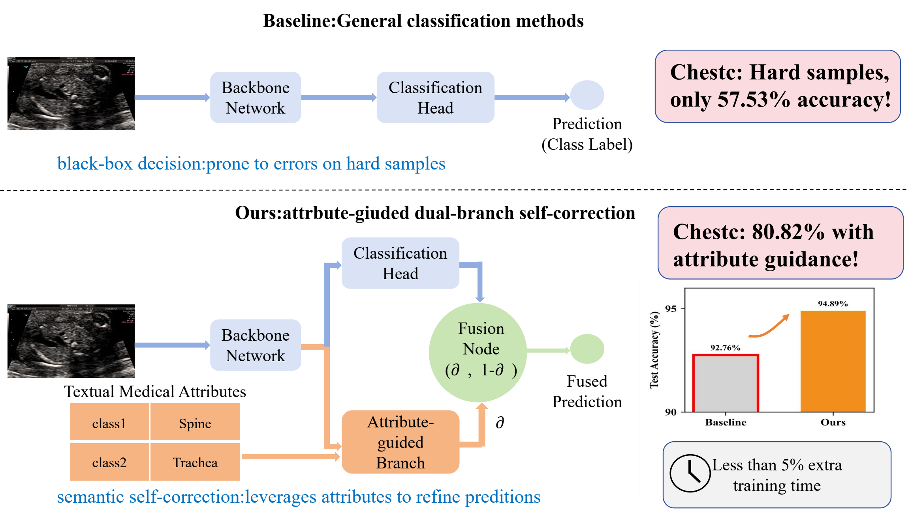
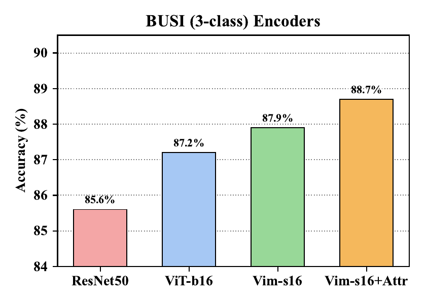
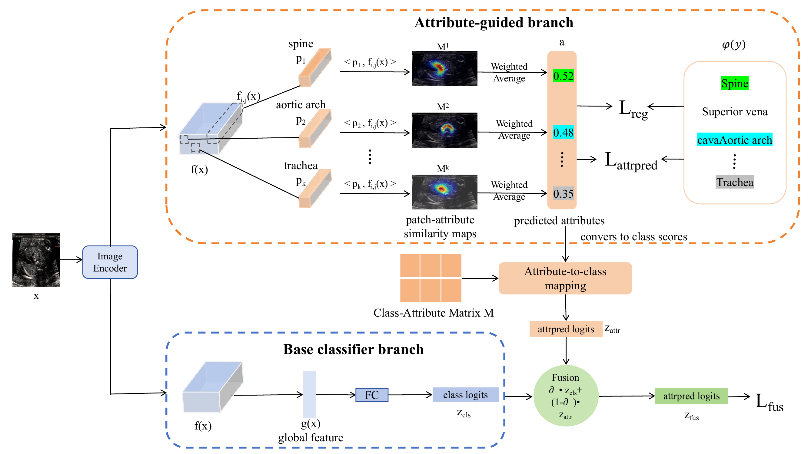
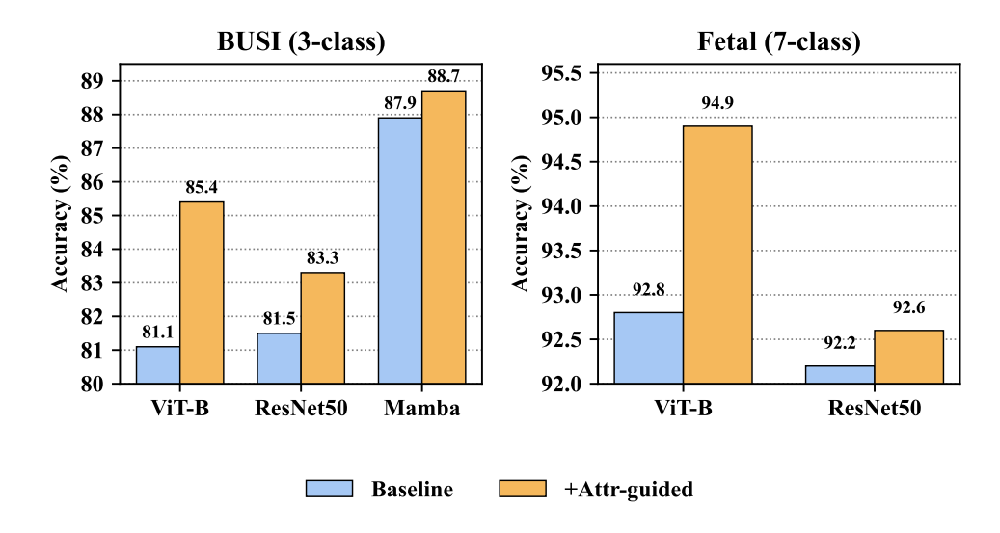
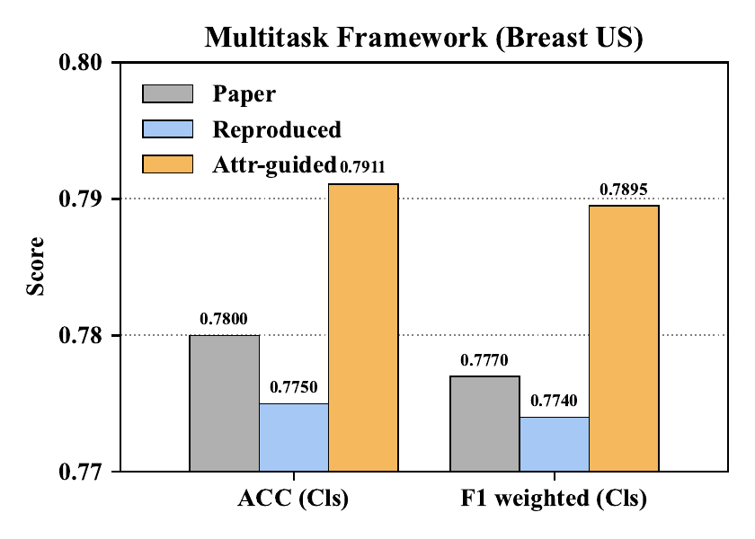
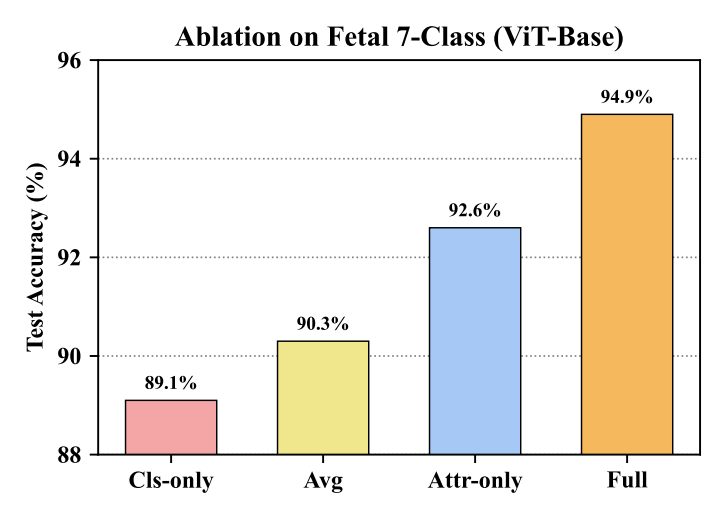
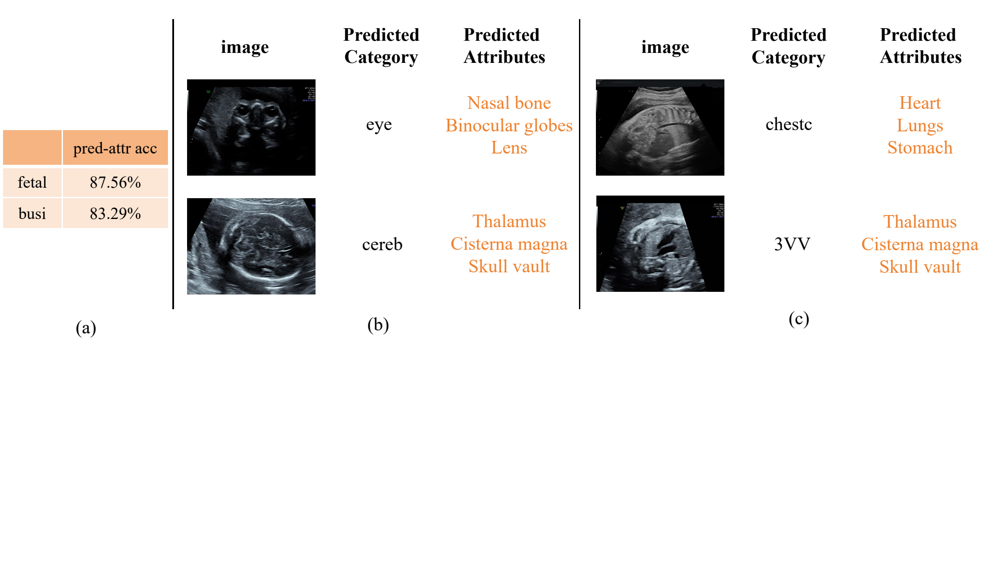

# Boosting Ultrasound Image Classification via Attribute-Guided Dual-Branch Framework

<p align="center">
  <a href="https://github.com/zhaobo253-crypto/AttrGuide">
    
  </a>
  <a href="#quick-start">
    
  </a>
  <a href="#data-preparation">
    
  </a>
  <a href="LICENSE">
    
  </a>
</p>

<p align="center">
  <b>AttrGuide: plug-and-play attribute guidance for interpretable ultrasound image classification.</b>
</p>

<p align="center">
  <a href="#introduction">Introduction</a> |
  <a href="#motivation">Motivation</a> |
  <a href="#method">Method</a> |
  <a href="#quick-start">Quick Start</a> |
  <a href="#main-results">Main Results</a> |
  <a href="#repository-structure">Repository Structure</a> |
  <a href="#citation">Citation</a>
</p>

<p align="center">
  
</p>

<p align="center">
  <sub><em><strong>Motivation overview.</strong> Conventional ultrasound classifiers may fail on hard cases, while AttrGuide introduces medical attribute priors as interpretable semantic evidence.</em></sub>
</p>

## Introduction

Ultrasound image classification is essential for computer-aided diagnosis, but ultrasound images often suffer from speckle noise, low contrast, operator dependence, and large cross-device appearance variation. Conventional deep classifiers can achieve strong performance, yet they may rely on superficial texture cues and provide limited clinical interpretability.

**AttrGuide** addresses this limitation with a lightweight attribute-guided dual-branch framework. The original encoder-classifier pipeline is kept as a baseline branch, while a parallel attribute-guided branch injects domain-agnostic medical attribute priors generated from clinical knowledge and encoded with CLIP. A simple adaptive decision module fuses the baseline prediction with the attribute-based prediction to improve robustness and provide interpretable evidence.

The current release provides training code, dataset wrappers, example attribute tables, direct Bash launchers, environment files, and sanitized public logs for the released experiments. Raw medical images and large local checkpoints are not redistributed.

## Motivation

AttrGuide is designed around two practical needs in ultrasound classification:

- **Robust generalization:** medical attribute priors such as shape, margin, texture, anatomy, and view-specific landmarks are less sensitive to scanner and acquisition shifts than raw visual texture alone.
- **Interpretable prediction:** attribute activations offer human-readable evidence that complements class logits and helps explain why a sample is assigned to a category.

<p align="center">
  
</p>

<p align="center">
  <sub><em><strong>Cross-backbone behavior.</strong> AttrGuide can be attached to different ultrasound classifiers with small overhead and consistent gains.</em></sub>
</p>

## Method

AttrGuide treats an existing ultrasound classifier as the baseline branch and adds an attribute-guided branch on top of the same image features.

<p align="center">
  
</p>

<p align="center">
  <sub><em><strong>AttrGuide framework.</strong> Image features are matched with CLIP-derived medical attribute prototypes, mapped through a fixed class-attribute matrix, and fused with the baseline class logits.</em></sub>
</p>

The framework contains three main components:

- **Medical attribute semantic space:** task-discriminative attributes are collected for each dataset and encoded into semantic prototypes with a CLIP text encoder.
- **Attribute-guided branch:** local image features are projected into the same semantic space and matched with attribute prototypes to produce attribute activations and attribute-based class logits.
- **Adaptive decision fusion:** baseline logits and attribute-guided logits are combined with a fusion weight and temperature to produce the final prediction.

During training, the released implementation optimizes a multi-task objective:

```text
L = lambda_fus * L_fus
  + lambda_reg * L_reg
  + lambda_attr_pred * L_attr_pred
```

where `L_fus` is the cross-entropy loss on fused logits, `L_attr_pred` is the binary attribute prediction loss, and `L_reg` aligns predicted attribute activations with the class-attribute matrix using MSE and cosine consistency.

## Contributions

- **Plug-and-play ultrasound classification:** AttrGuide can be attached to existing image classifiers with minimal structural changes.
- **Clinical-prior injection:** domain-agnostic medical attributes guide feature learning without requiring dense attribute annotations for every image.
- **Adaptive fusion:** global class evidence and attribute-based semantic evidence are reconciled at the decision level.
- **Interpretable evidence:** attribute activations expose semantic cues that support model predictions.

## Quick Start

### 1. Clone the repository

```bash
git clone https://github.com/zhaobo253-crypto/AttrGuide.git
cd AttrGuide
```

### 2. Set up the environment

The recommended environment is provided in `envs/environment.yml`.

```bash
conda env create -f envs/environment.yml
conda activate attrguide
```

If Conda is not available, create a Python 3.8 environment and install the pip dependencies:

```bash
pip install -r requirements.txt
```

The environment pins the main runtime used for this release, including PyTorch `1.12.0`, TorchVision `0.13.0`, Python `3.8`, scikit-learn, pandas, WandB, and OpenAI CLIP.

### 3. Data Preparation

Raw medical images are not included. Prepare datasets locally with class-folder names matching the `name` column in the attribute CSV.

```text
data/breast/
  train/benign/*.png
  train/malignant/*.png
  train/normal/*.png
  test/benign/*.png
  test/malignant/*.png
  test/normal/*.png

data/fetal/
  train/3vv/*.png
  train/aav/*.png
  train/bladder/*.png
  train/cereb/*.png
  train/chestc/*.png
  train/dav/*.png
  train/eye/*.png
  test/3vv/*.png
  test/aav/*.png
  test/bladder/*.png
  test/cereb/*.png
  test/chestc/*.png
  test/dav/*.png
  test/eye/*.png
```

A `val/` split is optional. If `val/` is absent, the loader creates a validation split from `train/` and keeps `test/` untouched for final evaluation.

Place backbone checkpoints under `pretrained/`, or pass custom paths with environment variables:

```text
pretrained/vit_b_16-c867db91.pth
pretrained/resnet50-11ad3fa6.pth
pretrained/clip/ViT-B-32.pt
```

The CLIP checkpoint is optional. If it is not provided, CLIP will use its default cache/download behavior.

### 4. Generate attribute embeddings

Example attribute tables are provided in `examples/`.

```bash
bash scripts/generate_breast_embeddings.sh
bash scripts/generate_fetal_embeddings.sh
```

For custom paths:

```bash
ATTR_CSV=/path/to/attributes_breast.csv \
OUTPUT_PATH=/path/to/attribute_embeddings_breast.pt \
bash scripts/generate_breast_embeddings.sh
```

### 5. Run experiments

Breast ultrasound ViT-Base:

```bash
DATA_ROOT=/path/to/breast_data \
ATTR_CSV=/path/to/attributes_breast.csv \
ATTR_EMB_PATH=/path/to/attribute_embeddings_breast.pt \
BACKBONE_WEIGHT=/path/to/vit_b_16-c867db91.pth \
bash scripts/train_breast_vitbase_attrguide.sh
```

Fetal ultrasound ResNet50:

```bash
DATA_ROOT=/path/to/fetal_data \
ATTR_CSV=/path/to/attributes_fetal.csv \
ATTR_EMB_PATH=/path/to/attribute_embeddings_fetal.pt \
BACKBONE_WEIGHT=/path/to/resnet50-11ad3fa6.pth \
bash scripts/train_fetal_resnet50_attrguide.sh
```

Fetal ultrasound ViT-Base:

```bash
DATA_ROOT=/path/to/fetal_data \
ATTR_CSV=/path/to/attributes_fetal.csv \
ATTR_EMB_PATH=/path/to/attribute_embeddings_fetal.pt \
BACKBONE_WEIGHT=/path/to/vit_b_16-c867db91.pth \
bash scripts/train_fetal_vitbase_attrguide.sh
```

Useful overrides:

```text
EPOCHS, BATCH_SIZE, LR, WEIGHT_DECAY, SAVE_DIR, NUM_WORKERS,
FUSION_WEIGHT, TEMPERATURE, LAMBDA_FUS, LAMBDA_REG, LAMBDA_ATTR_PRED
```

## Main Results

AttrGuide improves ultrasound classification across different datasets and backbones in the paper experiments.

<p align="center">
  
</p>

| Dataset | Backbone | Baseline Acc | AttrGuide Acc | Improvement |
| --- | --- | ---: | ---: | ---: |
| BUSI | ViT-B | 81.1 | 85.4 | +4.3 |
| Fetal | ResNet50 | 92.2 | 92.6 | +0.4 |
| Fetal | ViT-B | 92.8 | 94.9 | +2.1 |
| Thyroid | ResNet50 | 80.4 | 84.7 | +4.3 |
| Thyroid | ViT-B | 82.4 | 86.1 | +3.7 |

The public repository keeps sanitized logs under `results/public_logs/`. Large checkpoints should be released separately, for example through GitHub Releases, Zenodo, Hugging Face, or an institutional file service.

## Additional Analysis

<p align="center">
  
</p>

<p align="center">
  <sub><em><strong>Multi-task setting.</strong> Attribute guidance remains beneficial when classification is combined with auxiliary ultrasound tasks.</em></sub>
</p>

<p align="center">
  
</p>

<p align="center">
  <sub><em><strong>Ablation study.</strong> The attribute branch and adaptive fusion module provide complementary gains.</em></sub>
</p>

<p align="center">
  
</p>

<p align="center">
  <sub><em><strong>Interpretability.</strong> Attribute activations expose clinical cues that support the model prediction.</em></sub>
</p>

## Repository Structure

```text
AttrGuide/
|-- experiments/
|   |-- breast/
|   |   `-- vitbase_attrguide/
|   `-- fetal/
|       |-- resnet50_attrguide/
|       `-- vitbase_attrguide/
|-- scripts/
|   |-- generate_breast_embeddings.sh
|   |-- generate_fetal_embeddings.sh
|   |-- train_breast_vitbase_attrguide.sh
|   |-- train_fetal_resnet50_attrguide.sh
|   `-- train_fetal_vitbase_attrguide.sh
|-- examples/
|   |-- attributes_breast.csv
|   `-- attributes_fetal.csv
|-- envs/
|   |-- environment.yml
|   `-- requirements.txt
|-- results/public_logs/
|-- assets/readme/
|-- data/
|-- pretrained/
|-- MODEL_ZOO.md
|-- requirements.txt
`-- README.md
```

Local-only folders such as raw data, generated embeddings, checkpoints, WandB runs, logs, and Python caches are intentionally excluded from git.

## Reproducibility Notes

- Set the dataset path with `DATA_ROOT`.
- Set the attribute table with `ATTR_CSV`.
- Set generated attribute embeddings with `ATTR_EMB_PATH`.
- Set the ImageNet backbone checkpoint with `BACKBONE_WEIGHT`.
- Training outputs are written to `outputs/` by default or to `SAVE_DIR` if specified.

## Citation

If you use this code, please cite:

```bibtex
@misc{zhao2026attrguide,
  title  = {Boosting Ultrasound Image Classification via Attribute-Guided Dual-Branch Framework},
  author = {Zhao, Bo and Li, Yapeng and Liu, Juhua and Du, Bo},
  year   = {2026},
  note   = {Code available at https://github.com/zhaobo253-crypto/AttrGuide}
}
```
